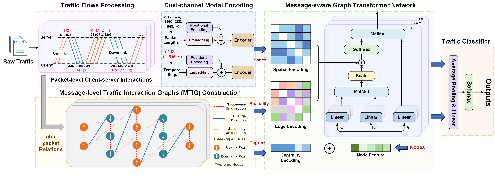

# DigTraffic
Code for the AAAI'25 paper:

"**Dual-Channel Interactive Graph Transformer for Traffic Classification with Message-Aware Flow Representation**"

The paper is selected as **Oral Presentation** in Thirty-Nineth AAAI Conference on Artificial Intelligence (AAAI 2025).

Conference AAAI 2025: Feb 25 - Mar 4, 2025, Philadelphia, PA, United States.

## Overview

## Dependency
 - Python: 3.10.9
 - pytorch: 1.13.1

## Code Information
 - Coming Soon!

## Contact Info
Email: <a href="mailto:230218524@seu.edu.cn">230218524@seu.edu.cn</a>
